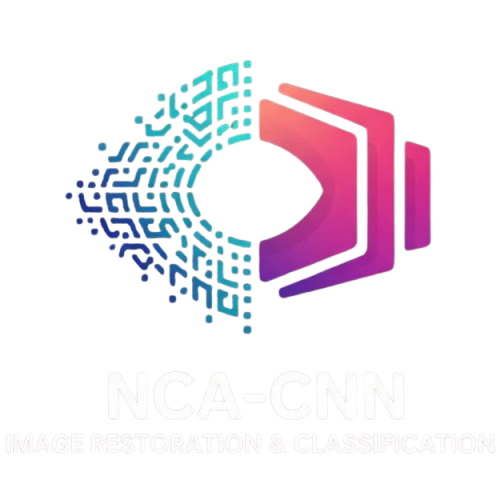
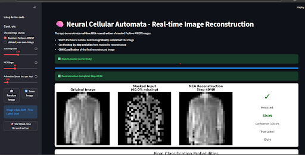
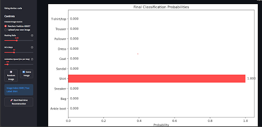

<div align="center">
  
</div>

---

<div align="center">
  <h1>
    🧠 NCA-CNN Image Restoration & Classification
  </h1>
</div>

<p align="center">
  <a href="https://streamlit.io">
    
  </a>
  <a href="https://pytorch.org">
    
  </a>
  <a href="https://github.com/topics/hacktoberfest">
    
  </a>
</p>

---

## 🌱 Project Motivation
Damaged or incomplete images—common in real-world data due to sensor noise, transmission errors, or masking—significantly reduce the accuracy of standard classification models. Traditional restoration methods often lack **adaptability and interpretability**.

This project tackles this challenge by introducing an **emergent AI system** that autonomously learns image reconstruction rules. We merge the self-organizing capabilities of **Neural Cellular Automata (NCA)** with the robust feature extraction of a **Convolutional Neural Network (CNN)** to dramatically enhance classification accuracy on damaged inputs.

---

## 🏗️ Core Architecture
The system functions as a streamlined, end-to-end pipeline visualized in a real-time Streamlit application.

| Pipeline Step | Component | Description |
| :--- | :--- | :--- |
| **1. Input & Masking** | Data Loader | Captures Fashion-MNIST or user-uploaded images and applies a customizable **random masking ratio** (e.g., 40%) to simulate damage. |
| **2. NCA Reconstruction** | `NeuralCA` | Iteratively reconstructs the missing spatial information over configurable steps (e.g., 40 steps). Each pixel acts as a mini-agent, using $3 \times 3$ convolutions for neighborhood perception to drive complex, **emergent** formation of the missing content. |
| **3. CNN Classification** | `SimpleCNN` | The final reconstructed, clean image is passed to a CNN for highly accurate 10-class prediction. |

## 📊 Performance Insight
The model demonstrates effective performance on the masked **Fashion-MNIST** dataset:
* **Dataset**: Fashion-MNIST (70,000 images across 10 fashion categories).
* **Input Damage**: 40% random masking applied to test robustness.
* **Classification Accuracy**: Achieved approximately **85%** accuracy on the reconstructed images.

---

## 📽️ Demo

The Streamlit application provides a full real-time animation of the process.

<div align="center">
  <h3>Step-by-Step Reconstruction Animation</h3>
  
  <p>The NCA model gradually fills in the missing pixels over 40 steps.</p>

  <h3>Final Classification Result</h3>
  
  <p>The reconstructed image is classified by the CNN with a high confidence score.</p>
</div>

---

## 🚀 How to Run Locally

### 1. Clone the repository and navigate to the directory
```bash
git clone https://github.com/akarshghildyal/NCA-CNN-Image-Restoration-Classifier.git
cd NCA-CNN-Image-Restoration-Classifier
```


### 2. Install dependencies
```bash
pip install -r requirements.txt
```

### 3. Launch the Streamlit app
```bash
streamlit run app.py
```
---

## 🤝 Contributing
I welcome contributions! Please refer to the **[CONTRIBUTING.md](CONTRIBUTING.md)** guide for details on submitting pull requests and my contribution guidelines.


---


###  Made with ❤️ for marks.
